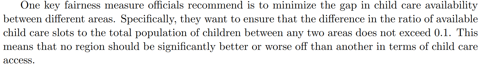

Since the time complex to set all the constraint is $`O(n^2)`$ need approximate 14 hours to set all constraint, thus propose a simplification as follow
### Definitions
Let:
- $` r_i `$ denote the ratio of available child care slots to the total population of children in area $` i `$.
- The maximum ratio across all areas is $` 1 `$.(truncate the areas if ratio>1)

### Original Constraint

The original constraint states that for any two areas $` i `$ and $` j `$, the difference in their ratios should not exceed $` 0.1 `$:

$$|r_i - r_j| \leq 0.1 \quad \forall \, i, j$$

### Deriving Equivalent Constraints

Given that the maximum ratio is $` 1 `$, assume without loss of generality that $` r_k = 1 `$ for some area $` k `$. Applying the original constraint between area $` k `$ and any other area $` i `$:

$$|r_i - 1| \leq 0.1$$

This can be rewritten as:

$$-0.1 \leq r_i - 1 \leq 0.1$$

Adding $` 1 `$ to all parts of the inequality:

$$0.9 \leq r_i \leq 1.1$$

However, since the maximum ratio is $` 1 `$, the upper bound $` 1.1 `$ is not feasible. Therefore, we refine the constraint to:

$$0.9 \leq r_i \leq 1 \quad \forall \, i$$

### Summary

By ensuring that each ratio $` r_i `$ lies between $` 0.9 `$ and $` 1 `$, we effectively maintain that the difference between any two ratios does not exceed $` 0.1 `$, aligning with the original constraint. A
This ensures that the difference between any two ratios $` r_i `$ and $` r_j `$ satisfies:

$$|r_i - r_j| \leq 0.1$$
